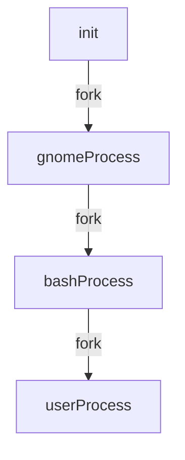
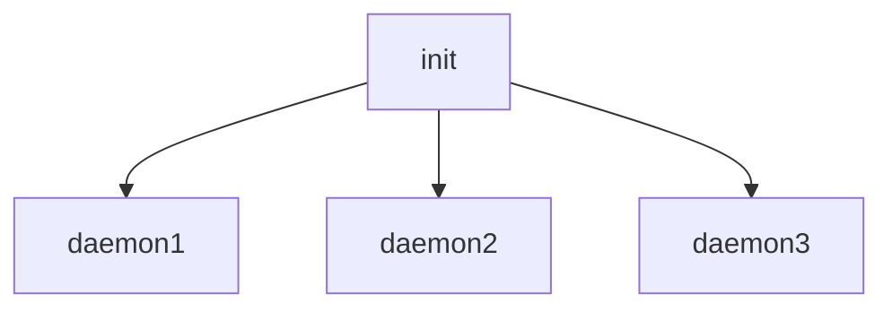
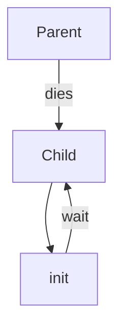
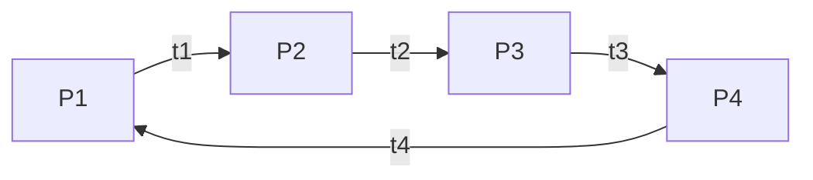

# Linux Processes

Processes are programs that are currently running on a Linux machine. Processes are managed by the **kernel**, and each process has a unique **PID (Process ID)**.

By default, a process started from a terminal is terminated when the associated terminal is closed (unless it is explicitly detached or run in the background).

---

## General Commands for Processes

| Command   | Description |
|----------|-------------|
| `ps`     | List processes of the current shell |
| `ps aux` | List all processes running on the system |
| `top`    | Display real-time process information |
| `htop`   | Enhanced interactive process viewer (if installed) |

---

## How a Process Starts

A new process in Linux starts using the **fork system call**.  
- The **parent process** requests the kernel to create a new process.
- The new process is called the **child process**.
- The child process is a clone of the parent, but with a different PID.
- The kernel decides and allocates resources for the child process.

---

## Mother Process (Init / systemd)

- The **mother process** is the **first process** started by the kernel during system boot.
- It always has **PID 1**.
- Traditionally this process was called **init**; on most modern systems it is **systemd**.
- It runs with **root privileges**.
- All processes are directly or indirectly children of this process.

---

## Daemon Process

- **Daemon processes** are background processes.
- They are usually **children of the mother process**.
- They provide system services and keep the system running.
- Examples include networking, logging, and scheduling services.

---

## How a Process Terminates

Process termination is handled using:
- **exit system call**
- **wait system call**

The kernel tracks process termination using a **termination status**:
- `0` → Successful termination
- Non-zero → Error or abnormal termination

Termination also includes cleaning up resources used by the process.

---

### Wait System Call

- The **parent process** must call `wait()` to:
  - Acknowledge the termination of its child
  - Collect the child's termination status
- This prevents leftover process entries in the process table.

---

## Orphan Process

- If a **parent process terminates before its child**, the child becomes an **orphan**.
- The kernel reassigns the orphan process to the **mother process (PID 1)**.
- The mother process later performs the `wait()` call.

---

## Zombie Process

- A **zombie process** is a child process that has:
  - Finished execution
  - But whose parent has not yet called `wait()`
- Zombie processes do **not consume CPU or memory**, but they occupy an entry in the process table.
- When the parent finally calls `wait()`, the zombie is removed (**reaping**).
- If the parent never calls `wait()`, the mother process eventually cleans it up.

---

# Signals

A **signal** is a notification sent to a process to inform it that an event has occurred.

## Common Signals

| Signal | Description |
|------|-------------|
| `SIGHUP (1)` | Hang up |
| `SIGINT (2)` | Interrupt (Ctrl+C) |
| `SIGKILL (9)` | Force kill (cannot be blocked) |
| `SIGSEGV (11)` | Segmentation fault |
| `SIGTERM (15)` | Graceful termination |
| `SIGSTOP (19)` | Stop process (cannot be blocked) |

Signals are commonly sent using the `kill` command.

---

## Nice & Renice

Processes do not run continuously. The CPU allocates time in small units called **time slices**.

By default, processes get similar CPU time, but priority can be adjusted using **nice** and **renice**.

- Lower nice value → Higher priority
- Higher nice value → Lower priority
- Nice values range from **-20 (highest priority)** to **19 (lowest priority)**

| Command | Description |
|--------|-------------|
| `nice -n value command` | Start a new process with priority |
| `renice value -p PID` | Change priority of an existing process |

---

## Signal Mask

- A **signal mask** is used to block certain signals from being delivered to a process.
- Some signals **cannot be blocked**, such as:
  - `SIGKILL`
  - `SIGSTOP`

---

## States of a Process

| State | Description |
|------|-------------|
| `R` | Running or runnable |
| `S` | Interruptible sleep |
| `D` | Uninterruptible sleep |
| `Z` | Zombie |
| `T` | Stopped |
